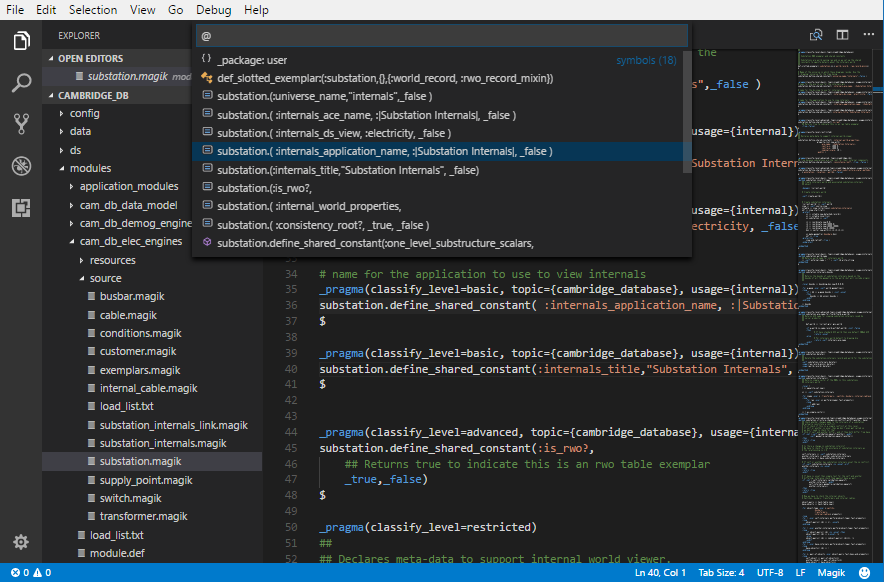
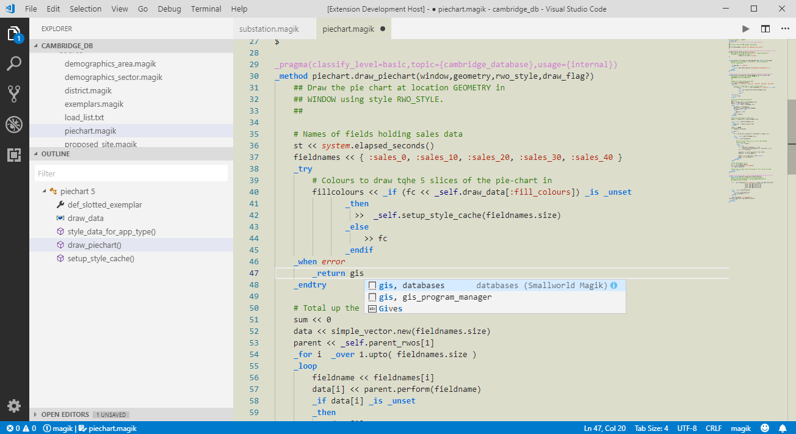

# Language support for Smallworld™ Magik 
This is a fast and modern IDE for [Smallworld](https://en.wikipedia.org/wiki/Smallworld) application development and [Magik](https://en.wikipedia.org/wiki/Magik_%28programming_language%29) programming language.

## Features
* Language grammar for Magik, gis_aliases, product.def, module.def, or message files.
* Autocorrection for Magik keywords.
* IntelliSense and auto-complete for Magik code and popular Smallworld commands.
* Symbol Provider for Magik and gis_aliases contents.
* Traditional light theme.  

## Getting Started
* Open your Smallworld Product folder, navigate through modules and click on one of source or resource files to activate this extension.
* View syntax grammar colours and edit Magik files with autocorrections e.g. if to _if.

* open the Symbol browser by CTRL-SHIFT-O and see a list of Exemplars, Methods, Procs, Blocks and other substructures of an object class in the file.

* Change the colour Theme to Smallworld Magik to get a traditional Light theme.

### Recommended Extensions
* Install [Code Outline](https://marketplace.visualstudio.com/items?itemName=patrys.vscode-code-outline) to get a better experience browsing your Magik or gis_aliases code.

## Extension Settings
This extension contributes the following settings:
* languages, grammars, themes, snippets.

## Release Notes
### 1.0.0
Basic support for Smallworld Magik source and resource file types, including Symbols and Autocorrection.
** Enjoy and share! **
