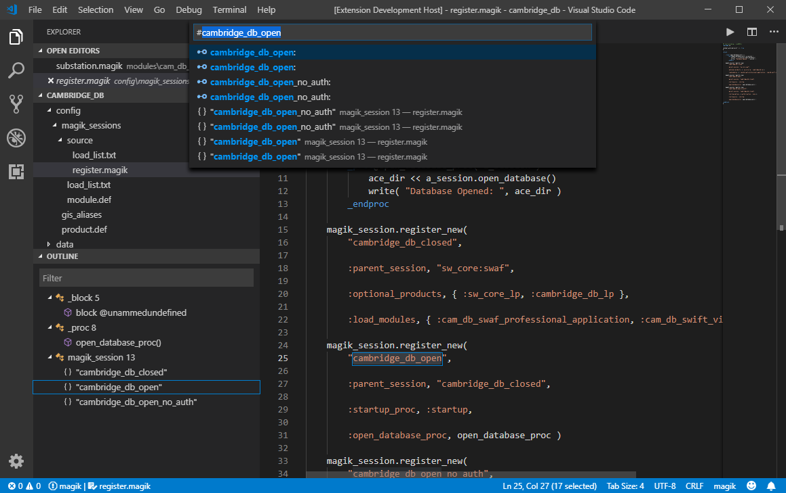
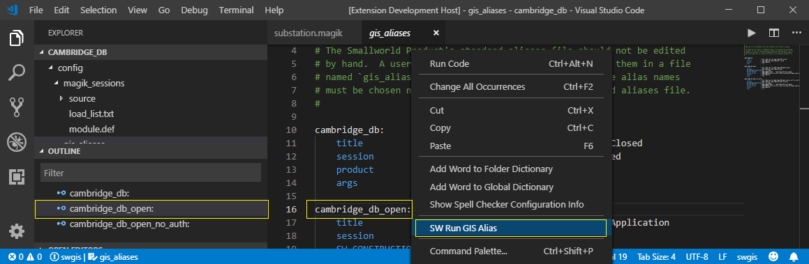

# Integrated Development Environment for Smallworld Magik

This is a fast and modern IDE for [Smallworld](https://en.wikipedia.org/wiki/Smallworld) application development and [Magik](https://en.wikipedia.org/wiki/Magik_%28programming_language%29) programming language.

## Features

* Language support for Magik source and Smallworld resource file types.
* Code outlines, Definitions, References and Symbol Provider for Magik and gis_aliases stanzas.
* Run Smallworld sessions and GIS Commands `F2-z` configuration. (Contributor: [MarkerDave](https://github.com/MarkerDave) )
* Magik code compiler, module and product loaders for Smallworld 5.x (Not supported on Smallworld 4). 
* Magik F2-keys shortcut combinations and a traditional light theme.  

---
## For Magik Developers

Get started with Smallworld 5.x cambridge_db example, based on your local installation in `C:\Smallworld`.  
* Open the cambridge_db product folder in VSCode
* start a session by keyboard shortcut `F2-z` and enter the following command: 
  -p C:\Smallworld\core -a %SMALLWORLD_GIS%\..\cambridge_db\config\gis_aliases cambridge_db_open

* Optionally save the GIS Command in Settings to the list of GIS Commands preconfigured for `F2-z`.
* Open a Magik file to see the code outline for classes and methods in the file.
* Add some Magik code to the file and use F2-b to compile the file.

* open the Symbol browser by CTRL-T and see a list of Object Exemplars, Methods, and Procs in the entire product tree, and click to jump to a definition.

* Change the colour Theme to Smallworld Magik to get a traditional Light theme.
* Click on a `Class.Method` combination, hold down CTRL to get Definition Peak or right-click for Definition and References in the context menu  

* Open a gis_aliases file, the stanzas appear boxed in Orange and have Code Actions (Yellow light bulb).
* Click the Light bulb to get the command to Start a Smallworld Session.
* An `environment.bat` in the same path as gis_aliases will automatically be loaded.

# Starting a Smallworld sessions 

### Run a GIS Command

* Press `F2-z` and enter a Smallworld 5 standard format command line _`  [-p productPath] [-e environFile] -a gis_aliasFile alias  `_ to start a session. 

### Run gis_aliases stanzas. (Contributor: [MarkerDave](https://github.com/MarkerDave) )

* Open a gis_aliases file, the stanzas appear boxed in Orange and have Code Actions (Yellow light bulb).
* Click the Light bulb to get the command to Start a Smallworld Session.
* An `environment.bat` in the same path as gis_aliases will automatically be loaded.

## Magik Compiler

* Set the Smallworld gis.exe path in the Settings and setup optional startup batch commands to run before the gis.exe.
* Open a gis_aliases file, the stanzas appear boxed in Orange and have Code Actions (Yellow light bulb).
* Click the Light bulb to Start a Smallworld Session.
* An `environment.bat` in the same path as gis_aliases will be loaded automatically.

## Magik Compiler

* Compile Magik code in a Smallworld 5 session, from the Code Actions or using key sequences:
    * `F2-b` or `F9` to compile the code buffer in the current editor 
    * `F2-r` or `Ctrl+F9` to compile the current code range (e.g. _method ... _endmethod)
    * `F2-s` or `Alt+F9` to compile the current code selection
    * `F2-l` or `Shift+F9` to compile the current single line of code
    * For F7 compiler keys see `Extension Settings` section below
* Access Class or Method `apropos` in Hover Actions over `object.method` definitions.

---
# Extension Settings

Open File-Preferences-Settings and search for Smallworld GIS under the `Extensions`. 

## Smallworld GIS Path (`Smallworld.gisPath`)

The `Smallworld.gisPath` defines the location of Smallworld gis.exe or the product path. The gisPath is an array of strings that allows configuration for multipe product locations.  
Example:
    "Smallworld.gisPath": [ "C:\\Smallworld5\\core", "C:\\Smallworld4\\product" ]

	

## Smallworld Startup (`Smallworld.startup`)

The `Smallworld.startup` is for the Windows DOS commands to run before gis.exe. This settings is a JSON array of strings. Invalid commands do not stop the startup process.
Example:

	{
		"Smallworld.startup": [
			"set JAVA_HOME=%SMALLWORLD_GIS%/jdk-11.0.1",
			"set PROJECT_DIR=//appserver/SW_Upgrade_5",
			"call %PROJECT_DIR%/set_my_environment.bat",
			"set SW_DB_CONTEXT_DIR=%PROJECT_DIR%/db_context",
			"if not exist %SW_DB_CONTEXT_DIR% mkdir %SW_DB_CONTEXT_DIR%"
		]
	}	

You can edit `Smallworld.startup` in the Settings editor in Visual Studio Code 1.37.0+.  

	

## GIS Command (`Smallworld.gisCommand`)

`Smallworld.gisCommand` section contains the configuration for GIS Commands that are executed by F2-z keys and starts a session from a standard Smallworld 5 command line.
A basic GIS Command have the following format:

	"[-p productDir] [-e environFile] -a gis_aliasFile [alias]"
 
If [-p productDir] is not specified, `Smallworld.gisPath` will be used.
If [-e environFile] is not specified, an `environment.bat` found in the same path as gis_aliasFile will be added to the command.
If [alias] is not specified and gis_aliasFile is a fully resolved pathname, all of the aliases in that file will be listed for GIS Command entries.
The `Smallworld.startup` Windows DOS commands are executed before a GIS command is run. 
You can edit `Smallworld.gisCommand` in the Settings editor in Visual Studio Code 1.37.0+.  

	

##GIS Command Session Configuration (`Smallworld.sessions`)

The advanced format for a GIS Command can be defined in the `Smallworld.sessions` section of settings in the form of a JSON object. 
GIS Commands defined in `Smallworld.sessions` are self contained and do not share or use the `Smallworld.startup` or `Smallwrold.gisPath` values. 
The`Smallworld.sessions` setting is defined in the following format:

	{
		"Smallworld.sessions": [
			{	
				"session": "< optional lable diaplayed on the list of GIS Commands F2-z >"
				"gisPath": "< optional Smallworld Core product directory (%SMALLWORLD_GIS%) >"
				"startup": "< optional DOS commands to run before gis.exe >"
				"command": "<[-p productDir] [-e envFile] [-j options] ... [-a aliasFile] alias ...>"
			}
		}
	}

An example configuration for multiple sessions is inlcuded in the next section. 
To edit the `Smallworld.sessions`, click on __`Edit in settings.json`__ in the Settings editor.

	

## A JSON Example for Smallworld Settings 

The following is an example of a settings.json file for a VSCode Smallworld Magik extension:

	{
		"Smallworld.gisPath": "//appserver/Smallworld/CST519/core/bin/x86/gis.exe",
		"Smallworld.startup": [
			"set JAVA_HOME=%SMALLWORLD_GIS%/jdk-11.0.1",
			"set PROJECT_DIR=//appserver/SW_Upgrade_5",
			"call %PROJECT_DIR%/set_my_environment.bat",
			"set SW_DB_CONTEXT_DIR=%PROJECT_DIR%/db_context",
			"if not exist %SW_DB_CONTEXT_DIR% mkdir %SW_DB_CONTEXT_DIR%"
		],
		"Smallworld.gisCommand": [
			"-p C:/Smallworld/core -a %SMALLWORLD_GIS%/../cambridge_db/config/gis_aliases cambridge_db_open",
			"-a C:/Smallworld/cambridge_db/config/gis_aliases cambridge_db_open"
		],
		"Smallworld.sessions": [
			{	
				"session": "Project 1 Test code on SW 5.1.9 on jdk 11",
				"gisPath": "C:/SW519/core",
				"startup": [ "set JAVA_HOME=C:/jdk-11.0.1","set PROJECT_DIR="C:/tst/project_1"],
				"command": "-a %PROJECT_DIR%/config/gis_aliases db_open"
			},
			{	
				"session": "Project 1 Development on SW 5.2.0 on jdk 12",
				"gisPath": "C:/SW520/core",
				"startup": ["set JAVA_HOME=C:/jdk-12.0.2","set PROJECT_DIR="C:/dev/project_1"],
				"command": "-a %PROJECT_DIR%/config/gis_aliases db_open"
			},
			{	
				"session": "Project 1 Production on SW 5.1.8 on jre 8",
				"gisPath": "C:/SW518/core",
				"startup": ["set JAVA_HOME=C:/jre","set PROJECT_DIR="C:/prd/project_1"],
				"command": "-a %PROJECT_DIR%/config/gis_aliases db_open"
			}
		],
		"files.autoGuessEncoding": true,
		"terminal.integrated.scrollback": 5000
	}

## Compiler F7 Key Combinations
To define F7 key combinations for the Magik compiler:

- Open Preferences Keyboard Shortcuts (Ctrl-K Ctrl-S)
- Type "SW Compile Magik" in the filter to find the Magik compiler commands
- Select the commands you want to change (for example F9 keys) and edit to F7 

# Release Notes

## [1.4.0] - 2019-08-04

* New GIS Command (F2-z) to start a session. 
* Multi-environment configuration for GIS path, command and startup.
* Support for Case and Style archive files.
* Various bug fixes and improvements. 

## Known Issues 

### Limited Support for Smallworld Older Versions
There are some limitations for Smallworld versions older than 5.0: 

* GIS Command syntax does not fully support Smallword 3.x and 4.x 
* Smallworld 3.x and 4.x sessions are not integrated Terminals
* Magik Compiler commands do not support Smallworld 3.x and 4.x

### Workspace Close\Open Terminates the Session.
Opening/closing a Workspace or the active Folder while a Smallworld Session is running, will terminate the session without a warnings.

**Workarounds:** 
* Use `Add Folder to Workspace...` to access the sourece tree
* Quit the Smallworld Session before switching the active Folder or Workspace.

