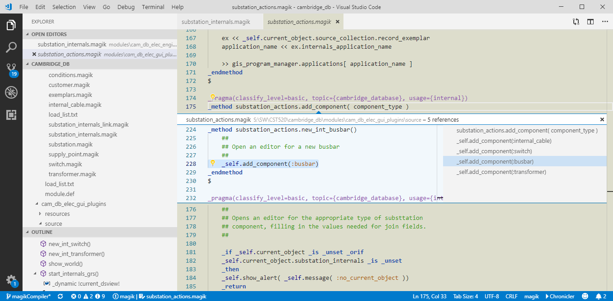

# Language support for Smallworld Magik

This is a fast and modern IDE for [Smallworld](https://en.wikipedia.org/wiki/Smallworld) application development and [Magik](https://en.wikipedia.org/wiki/Magik_%28programming_language%29) programming language.

## Features

* Language grammar for Magik, gis_aliases, product.def, module.def, and message files.
* Autocorrection, IntelliSense and autocomplete for Magik keywords and popular Smallworld commands.
* Symbol, Definition and Reference Provider for Magik Class and gis_aliases stanzas.
* Start Smallworld sessions from gis_aliases stanzas. (Contributor: [MarkerDave](https://github.com/MarkerDave) )
* Magik compiler, module and product loaders Code Actions for Smallworld 5 (not supported on Smallworld 4). 
* Magik traditional light theme, F2 and F7 combinations key bindings.  

## For Magik Developers

* Open a Smallworld Product folder, or click on a Magik source file to activate this extension.
* Open a Magik file to see the code outline for classes and methods in the file.
* Start typing Magik code to get keyword autocorrections and autocomplete features.

* open the Symbol browser by CTRL-T and see a list of Object Exemplars, Methods, and Procs in the entire product tree, and click to jump to a definition.

* Change the colour Theme to Smallworld Magik to get a traditional Light theme.
* Click on a "Class.Method" combination, hold down CTRL to get Definition Peak or get Definition and References in the context menu  

## Start Smallworld sessions from gis_aliases stanzas. (Contributor: [MarkerDave](https://github.com/MarkerDave) )

* Set the Smallworld gis.exe path in the settings and setup optional starup batch commands to run before the gis.exe.
* Open a gis_aliases file, the stanzas appear boxed in Orange and have Code Actions (Yellow light bulb).
* Click the Light Bulb to get the command to Start a Smallworld Session.
* An 'environment.bat' in the same path as gis_aliases will automatically be loaded.

This is tested with Smallworld 4.3 and Smallworld 5.1.9

* Compile Magik code, from the Code Actions or using key sequences:
    * 'F2 b' or 'F9' to compile the current file, 
    * 'F2 r' or 'Ctrl+F9' to compile the current code block, 
    * 'F2 s' or 'Alt+F9' to compile the current code selection.
    * 'F2 l' or 'Shift+F9' to compile the current single line of code.
    * For F7 compiler keys see "Extension Settings" section below.
* Access Class or Method 'apropos' in Hover Actions over 'object.method' definitions.

## Extension Settings

### Smallworld GIS Path

Open File-Preferences-Settings, expand Extensions - Smallworld GIS and click on "Edit in settings.json". 
Add the "Smallworld.gisPath" entry for Smallworld gis.exe path. Use double backslash '\\' or single forward slash '/'. 
Example:
    "Smallworld.gisPath": "C:/Smallworld/core/bin/x86/gis.exe"

### Smallworld Startup 

Optionally, add "Smallworld.startup" entry for any startup batch commands to run before gis.exe. Invalid commands do not stop the startup process.
Example:
    "Smallworld.startup": ["set PROJECT_DIR=C:/SW5/cambridge_db","call %PROJECT_DIR%/config/test_env.bat"]

The following is an example of a settings.json file for a VSCode Smallworld Magik extension:

{
    "Smallworld.gisPath": "//appserver/Smallworld/CST519/core/bin/x86/gis.exe",
    "Smallworld.startup": [
        "set JAVA_HOME=%SMALLWORLD_GIS%/jdk-11.0.1",
        "set PROJECT_DIR=//appserver/SW_Upgrade_5",
        "call %PROJECT_DIR%/set_my_environment.bat",
        "set SW_DB_CONTEXT_DIR=%PROJECT_DIR%/db_context",
        "if not exist %SW_DB_CONTEXT_DIR% mkdir %SW_DB_CONTEXT_DIR%"
    ],
    "editor.fontSize": 12,
    "files.autoGuessEncoding": true,
    "terminal.integrated.scrollback": 5000
}

### Compiler F7 Key Combinations
To define F7 key combinations for the Magik compiler:

- Open Preferences Keyboard Shortcuts (Ctrl-K Ctrl-S)
- Type "SW Compile Magik" in the filter to find the Magik compiler commands
- Select the commands you want to change (for example F9 keys) and edit to F7 

## Release Notes

### 1.3.0

* New Reference and Definition Provider 
* Performance improvement in Workspace Symbol Provider 
* Enhancements to syntax colouring for the Smallworld Light Theme 
* Magik Compiler commands for user key bindings swSessions.compileSelection(F2-s), swSessions.compileFile(F2-b), swSessions.compileLine(F2-l) and swSessions.compileRange(F2-r). 

